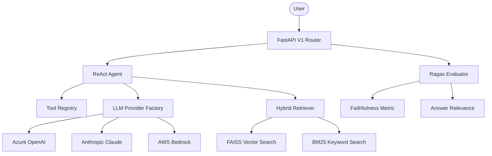

# Comprehensive Agentic AI Framework

An advanced, research-oriented NLP orchestrator built for complex multi-step reasoning, hybrid retrieval, and automated evaluation.

## 🏗️ Technical Architecture



## 🧠 Core Components

### 1. Hybrid Retriever (`src/core/rag/hybrid_retriever.py`)
Combines the strengths of semantic search (FAISS) and lexical search (BM25). Results are fused using **Reciprocal Rank Fusion (RRF)** to ensure high precision and recall across diverse query types.

### 2. ReAct Agent (`src/core/agents/react_agent.py`)
Implements the **Reason + Act** paradigm. The agent decomposes complex queries into multiple steps, selects appropriate tools, and refines its strategy based on intermediate observations.

### 3. LLM Provider Factory (`src/core/llm/provider_factory.py`)
A robust implementation of the **Factory Pattern** supporting seamless switching between enterprise-grade LLM providers:
- **Azure OpenAI**
- **Anthropic (Claude 3)**
- **AWS Bedrock**

### 4. Ragas-Inspired Evaluator (`src/eval/metrics.py`)
Automated evaluation suite calculating:
- **Faithfulness**: Is the answer derived solely from the provided context?
- **Answer Relevance**: How well does the answer address the question?
- **Context Precision/Recall**: How relevant is the retrieved context?

### 5. Professional API Structure (`src/api/v1/router.py`)
Modular FastAPI routing with built-in logging, detailed error handling, and Pydantic-validated request/response models.

## 🚀 Getting Started

### Installation
```bash
pip install -r requirements.txt
```

### Configuration
Create a `.env` file with your provider credentials:
```env
AZURE_OPENAI_API_KEY=...
ANTHROPIC_API_KEY=...
AWS_ACCESS_KEY_ID=...
```

### Usage
Run the API server:
```bash
uvicorn src.main:app --reload
```

## 🧪 For Researchers
This framework is designed for extensibility. To add a new retrieval strategy, inherit from `BaseRetrieverStrategy` in `hybrid_retriever.py`. For custom agent logic, the `ReActAgent` class can be easily extended to support other prompting techniques (e.g., Chain-of-Thought, Tree-of-Thoughts).

---
*Developed by the Senior Research Engineering Team.*
